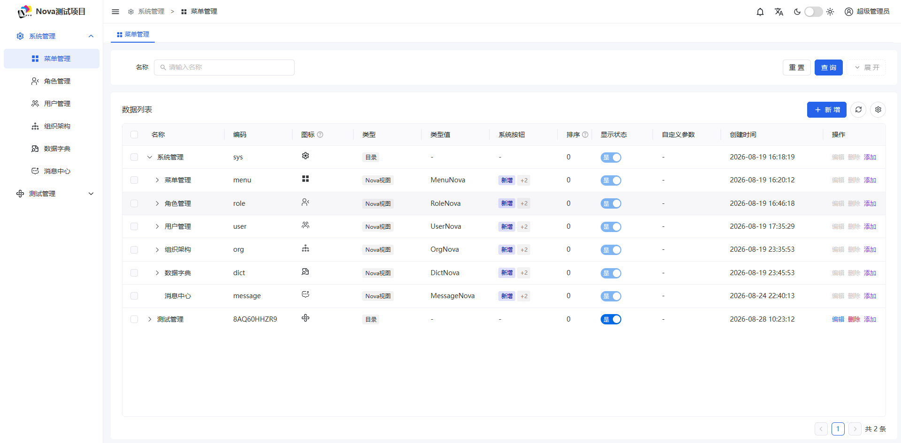
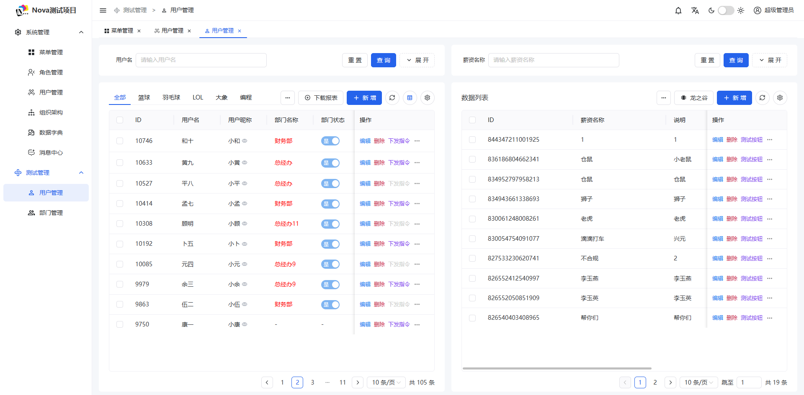
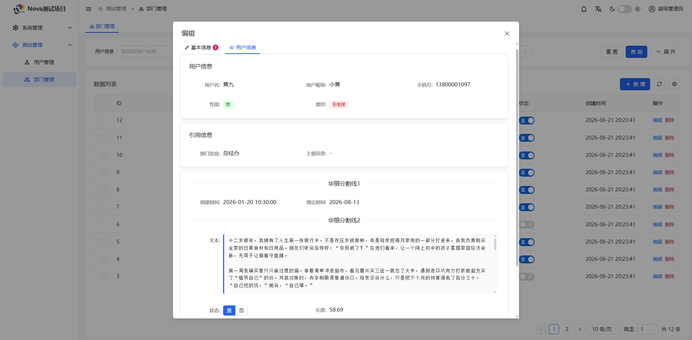

<h1 align="center">🚀 Nova 全栈框架</h1>

<p align="center">
  <strong>JDK 21 · Spring Boot 3.3.4 · Naive UI · 零前端实现管理系统搭建</strong>
</p>

<p align="center">
  📖 <strong>使用文档：</strong><a href="https://www.yuque.com/laoshiren-bne7g/nova">https://www.yuque.com/laoshiren-bne7g/nova</a>
</p>
<p align="center">
  🔑 <strong>演示账号：</strong>show / 123456
</p>

<p align="center">
  <a href="https://www.yuque.com/laoshiren-bne7g/nova"></a>
  <a href="http://182.43.87.39:8989"></a>
  <a href="LICENSE"></a>
</p>

---

## ✨ 简介

**Nova** 是一款基于注解驱动的全栈后台协议框架。开发者只需编写 Java 注解描述数据与视图，Nova 便会自动编译生成前端渲染协议（JSON），由前端框架（Naive UI）实时解析并渲染出完整的增删改查管理界面。

### 核心理念

> **后端定义视图，前端只负责渲染。**

❌ **不绑定任何数据源** (MyBatis, MyBatis-Plus, JPA 皆可接入)  
❌ **不生成任何代码文件** (运行期动态解析)  
❌ **不提供 CRUD 模板** (一切皆协议)

---

## 🧩 核心特性

| 特性 | 描述 |
|:---|:---|
| 🧬 **现代技术底座** | 基于 JDK 21 + Spring Boot 3.x + Naive UI 构建 |
| 📡 **视图全协议驱动** | 后端通过注解定义界面元素，全程 0 前端代码参与绑定 |
| 🧩 **多形态布局** | 原生支持表格、树形、左右双表、Tab 页签等多种复杂布局 |
| 🔐 **后端权限管控** | 菜单、操作按钮、字段级权限均由后端统一裁剪返回 |
| 🔗 **上下文联动** | 支持主从数据联动、交互状态传递与穿透 |
| 🚪 **灵活可扩展** | 提供 Custom View (Tpl) 和 Custom JS，无缝接入自定义业务逻辑 |

---

## 📦 代码示例

只需定义实体类并实现 `DataProxy` 接口，即可自动生成管理页面：

```java
@Data
@Accessors(chain = true)
@Nova(
        name = "用户管理",
        dataProxy = UserServiceImpl.class,
        conditionClass = UserCondition.class
)
public class UserNova {

    @NovaId
    @NovaField(
            views = @View(title = "ID"),
            edit = @Edit(title = "ID", show = false)
    )
    private String id;

    @NovaField(
            views = @View(title = "用户名"),
            edit = @Edit(title = "用户名", notNull = true, search = @Search)
    )
    private String name;

    @NovaField(
            views = @View(title = "性别"),
            edit = @Edit(
                    title = "性别",
                    type = Edit.Type.CHOICE,
                    choiceType = @ChoiceType(
                            vl = {
                                    @VL(value = "1", label = "男", color = "#28f439"),
                                    @VL(value = "2", label = "女", color = "#fe6767")
                            }
                    ),
                    notNull = true
            )
    )
    private Integer sex;

    // 复杂组件演示：多选标签
    @NovaField(
            views = @View(title = "技术栈"),
            edit = @Edit(
                    title = "技术栈",
                    type = Edit.Type.CHOICE,
                    choiceType = @ChoiceType(
                            selectType = ChoiceType.SelectType.MULTI,
                            vl = {
                                    @VL(value = "Java", label = "Java"),
                                    @VL(value = "Python", label = "Python"),
                                    @VL(value = "Go", label = "Golang")
                            }
                    )
            )
    )
    private String skill;
}
```

---

## 🖥️ 页面预览

<p align="center">
  
  
</p>
<p align="center">
  
  
</p>

---

## 🚀 快速开始

1.  **添加依赖**
    在你的 Spring Boot 项目 `pom.xml` 中引入 Starter：
    ```xml
    <dependency>
        <groupId>xyz.nova</groupId>
        <artifactId>nova-spring-boot-starter</artifactId>
        <version>${latest.version}</version>
    </dependency>
    ```

2.  **启用扫描**
    在启动类上添加 `@NovaScan` 注解：
    ```java
    @NovaScan
    @SpringBootApplication
    public class Application {
        public static void main(String[] args) {
            SpringApplication.run(Application.class, args);
        }
    }
    ```

3.  **定义 Nova 视图**
    创建一个类，添加 `@Nova` 注解，并实现 `DataProxy` 接口。

---

## 📄 许可证

Nova 采用 [Apache License 2.0](LICENSE) 开源协议。